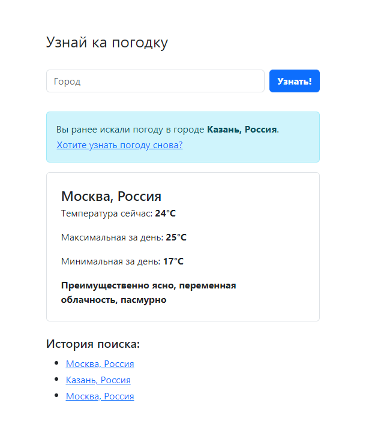

# Тестовое задание Python Developer от О-комплекс

### Разработать WEB-приложение погоды на день

* Веб фреймворк - Django

* API для погоды: https://open-meteo.com/

* Присутствуют подсказки при вводе города

* Сохраняется информация о трёх последних городах, которые интересовали пользователя и предлагается быстрый переход на погоду в этих городах

* Функции и интерфейс покрыты тестами

* Есть возможность запускать сразу в Docker

| |
|:--:|
| *Интерфейс сайта* |

Чтобы скачать проект
```bash
git clone https://github.com/DanilAiro/test-O-complex-DjangoWeatherWebApp.git
cd test-O-complex-DjangoWeatherWebApp/DjangoWeather
```

Для запуска через Docker
```bash
docker-compose up --build
```

Для простого запуска
```bash
python -m venv .venv
source .venv/bin/activate
pip install -r requirements.txt
python manage.py migrate
python manage.py runserver
```

Для запуска тестов функций
```bash
pytest main/tests/test_views.py
```

Для запуска тестов интерфейса
```bash
pytest main/tests/test_ui.py
```